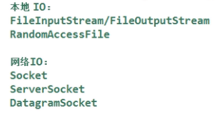

# NIO

# NIO简介

new IO 可以代替标准Java IO API

后两个区别是针对网络通讯的。

# 1.缓冲区

通道和缓冲区：Java NIO系统的核心在于：**通道**(Channel)和**缓冲区**(Buffer)。通道表示打开到IO设备（例如：文件、套接字）的连接。若需要使用NIO系统，需要获取用于连接IO设备的通道以及用于容纳数据的缓冲区。然后操作缓冲区，对数据进行处理。

在Java NIO中负责数据的存取。缓冲区就是数组。用于存储不同数据类型的数据。根据数据类型不同（boolean除外），提供了相应类型的缓冲区：ByteBuffer,CharBuffer,ShortBuffer,IntBuffer,LongBuffer,FloatBuffer,DoubleBuffer.

上述缓冲区的管理方式几乎一致，通过allocate()获取缓冲区。 

缓冲区存取数据的两个核心方法：

1. put():存入数据到缓冲区中
2. get():获取缓冲区中的数据。

缓冲区中的四个核心属性：

1. capacity：容量，表示缓冲区中最大存储数据的容量。一旦声明不能改变。
2. limit：界限，表示缓冲区中可以操作数据的大小。（limit后数据不能进行读写）
3. position：位置，表示缓冲区中正在操作数据的位置。
4. mark:标记，表示记录当前position的位置。可以通过reset()恢复到mark的位置。

0<=mark<=position<=limit<=capacity

rewind():可重复读

clear():清空缓冲区。但是缓冲区中的数据依然存在，只是处于被遗忘状态，等待被覆盖。

hasRemaining():缓存区中是否还有剩余数据。

remaining():获取缓冲区中可以操作的数量。

# 2.直接缓冲区与非直接缓冲区

非直接缓冲区：通过allocate()方法分配缓冲区，将缓冲区建立在JVM的内存中。

直接缓冲区：通过allocateDirect()方法分配直接缓冲区，将缓冲区建立在物理内存中。可以提高效率。

直接缓冲区的方式只有ByteBuffer支持。

直接缓冲区的缺点：分配和销毁耗费的资源更大。将数据写入内存中后就不再归应用程序管，不易控制。

buffer通过isDirect()来判断是否是直接缓冲区。

# 3.通道的原理与获取

通道类似于DMA，如果有大量的IO请求，可以节省CPU的利用率。

通道(Channel)：用于源节点与目标节点的连接。在Java NIO中负责缓冲区中数据的传输。Channel本身不存储数据，类似于铁路，因此需要配合缓冲区进行传输。

二：通道的主要实现类：

FileChannel用于本地传输，下面三个用于网络IO。

三：获取通道：

1. Java针对支持通道的类提供了getChannel()方法，可以获取对应的通道。
2. 在JDK1.7中NIO.2针对各个通道提供了静态方法open()
3. 在JDK1.7中的NIO.2的Files工具类的newByteChannel()

# 4.分散读取与聚集写入

分散读取：将通道中的数据分散到多个缓冲区中。

聚集写入：将多个缓冲区中的数据聚集到通道中。

注意：按照缓冲区的顺序，从Channel中读取到的数据**依次**将Buffer**填满**。

按照缓冲区的顺序，写入数据到Channel。

区别就是之前是操作缓冲区，现在是操作缓冲区数组。

# 5.字符集Charset

编码：字符串->字节数组

解码：字节数组->字符串

# 6.阻塞与非阻塞

FileChannel不能切换成非阻塞模式。

## 阻塞式网络通信

1. 通道：负责连接。
2. 缓冲区：负责数据的存取
3. 选择器：是SelectableChannel的多路复用器。用于监控SelectableChannel的IO状况。

 